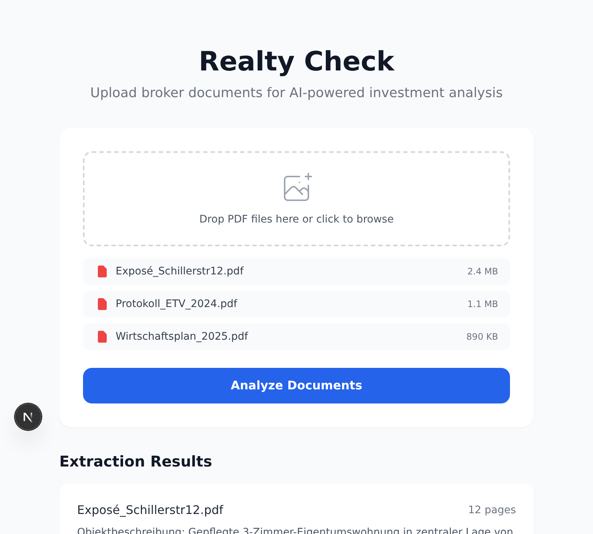
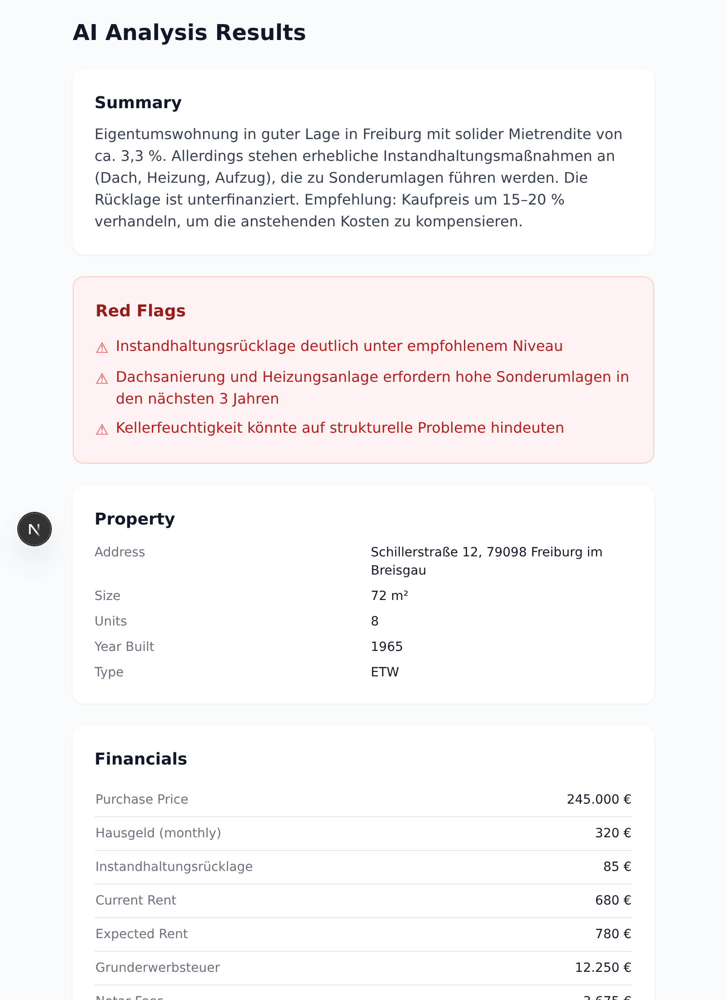
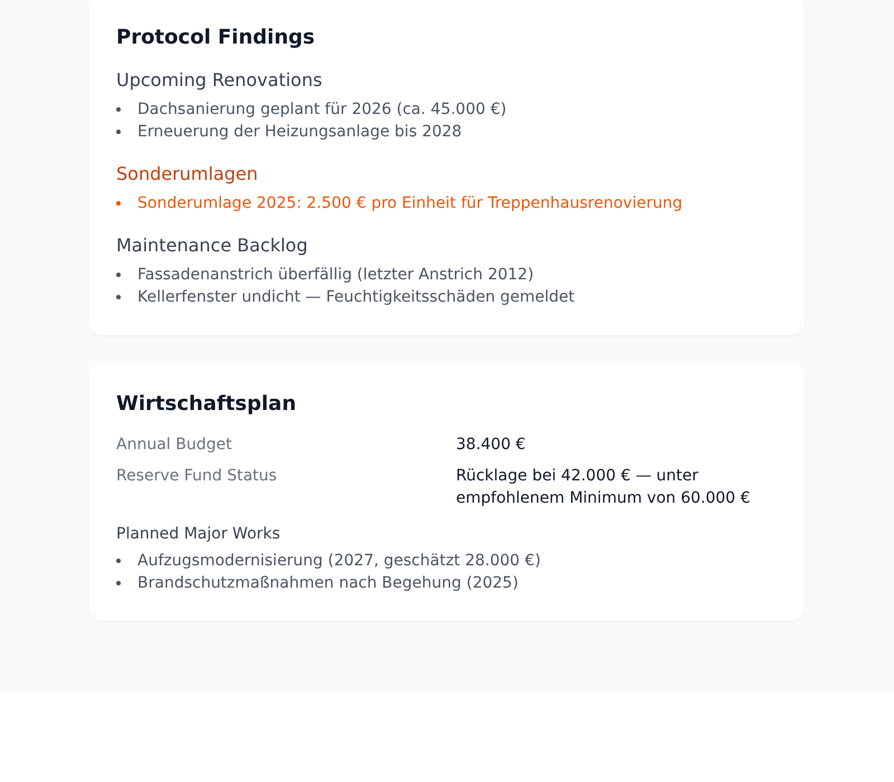

# Realty Check

German real estate investment analysis tool. Upload broker PDFs (Exposés), extract property data, and calculate key investment metrics.

Built with Next.js, TypeScript, and the Anthropic SDK.

## Screenshots

### Upload & Extract

Upload broker PDFs (Exposés, Protokolle, Wirtschaftspläne) and extract text for analysis.



### AI Analysis

Claude analyzes extracted documents and returns structured property data, financials, and risk assessment.



### Protocol Findings & Wirtschaftsplan

Surfaces renovation plans, Sonderumlagen, maintenance backlog, and budget details from owner meeting protocols.



## Features

- **PDF Upload** — drag-and-drop or click to upload broker PDFs via `react-dropzone`
- **Text Extraction** — extracts text from uploaded PDFs using `pdf-parse`
- **AI Analysis** — sends extracted text to Claude to identify property details and financials (address, sqm, purchase price, Hausgeld, rent, etc.)
- **Investment Calculator** — computes key German real estate metrics:
  - Kaufnebenkosten (purchase costs: Grunderwerbsteuer, Notar, Grundbuch, Makler)
  - Net rental yield
  - Cashflow analysis
- **Visualization** — charts via `recharts`

## Tech Stack

| | |
|---|---|
| Framework | Next.js (App Router) |
| Language | TypeScript |
| Styling | Tailwind CSS |
| PDF parsing | `pdf-parse` |
| AI | Anthropic SDK (Claude) |
| Charts | Recharts |
| Testing | Jest |

## Getting Started

```bash
npm install
npm run dev
```

Open [http://localhost:3000](http://localhost:3000).

## API Routes

| Route | Method | Description |
|-------|--------|-------------|
| `/api/upload` | POST | Upload PDF files |
| `/api/extract` | POST | Extract text from uploaded PDFs |
| `/api/analyze` | POST | AI analysis of extracted property data |
| `/api/calculate` | POST | Calculate investment metrics |

## Project Structure

```
src/
├── app/
│   ├── api/
│   │   ├── analyze/       # Claude-powered property analysis
│   │   ├── calculate/     # Investment metric calculations
│   │   ├── extract/       # PDF text extraction
│   │   └── upload/        # File upload handling
│   ├── components/
│   │   └── UploadZone.tsx # Drag-and-drop upload component
│   ├── layout.tsx
│   └── page.tsx           # Main UI
├── lib/
│   └── calculator.ts      # Investment calculation logic
└── types/
    └── pdf-parse.d.ts     # Type definitions
```

## Development

```bash
npm test              # Run tests
npm run build         # Production build
npm run lint          # ESLint
npx tsc --noEmit      # Type check
```

## CI

This repo is onboarded to [dev-agents](https://github.com/bing107/dev-agents). Label any issue with `dev-agents` to trigger an automated pipeline that designs, implements, tests, reviews, and merges a PR.

## License

Private.
